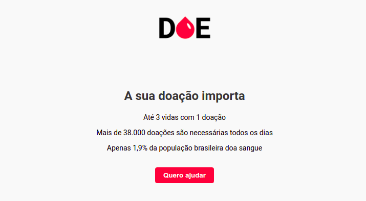

# Maratona Dev 3 da Rocketseat

## Aplicação Desenvolvida: DOE

 * Uma página com informações sobre a importância da doação de sangue.
 * Cadastro dos doadores.
 * Exibição dos doadores cadastrados.

### Ferramentas
 * Visual Studio Code.
 * Google Chrome.
 * Node.JS LTS.
 * PostgreSQL.
 * Postbird.

## Abordagem de Front-end e Back-end
 *  Cliente / Servidor.
 *  Comunicação HTTP:
    *  Hypertext Transfer Protocol (HTTP).

## Front-End
 * Apresentar as informações aos usuários.
 * Tecnologias:
   * HTML (Estrutura):
     * Hypertext Markup Language.
     * Texto com links para outros documentos.
     * Marcações por tag's.
   * CSS (Estilo):
     * Cascade Stylesheet.
     * Espaços, fontes, cores, posicionamentos, larguras e alturas.
   * Javascript (Inteligência):
     * Ecmascript básico.

## Back-End
 * Servidor de informações ao Front-End.
 * Responsabilidades:
   * Regras de negócio.
   * Banco de Dados.
     * Os Dados não podem ficar na aplicação.
     * Perda / Corromper.
     * Segurança.
     * Isolamento de Responsabilidades.
     * SQL:
       * Structured Query Language.
       * Não é linguagem de programação.
       * Criar tabelas, buscar dados nas tabelas, atualizar ou apagar.
   * Receber pedidos do cliente.
 * Tecnologias:
   * Node.JS:
     * Interpretador de Javascript.
     * Motor V8 do Google Chrome.
     * Ferramentas:
       * Express Server Framework.
       * Nodemon monitor.
       * Nunjucks template engine.
   * PostgreSQL:
     * Sistema Gerenciador de Banco de Dados Relacional (SGBDR).
     * Open Source.
     * Gratuito.