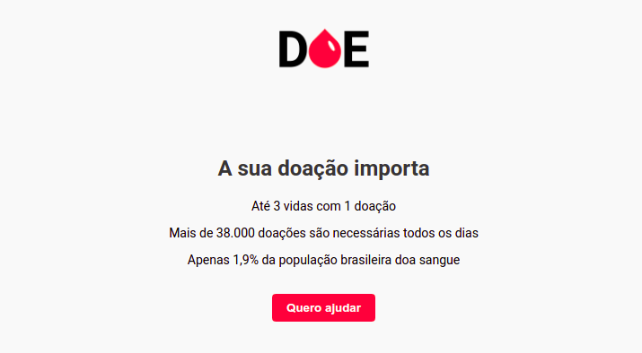

# Projeto Desenvolvido na Maratona Dev 3 da Rockeseat

## Aplicação Desenvolvida: DOE

 * Uma página com informações sobre a importância da doação de sangue.
 * Cadastro dos doadores.
 * Exibição dos doadores cadastrados.

### Ferramentas
 * Visual Studio Code
 * Google Chrome

### Abordagem de Front-end e Back-end
 *  Cliente / Servidor
 *  Comunicação HTTP
    *  Hypertext Transfer Protocol (HTTP)

## Front-End
 * Tecnologias:
   * HTML (Estrutura)
     * Hypertext Markup Language
     * Texto com links para outros documentos
     * Marcações por tag's
   * CSS (Estilo)
     * Cascade Stylesheet
     * Espaços, fontes, cores, posicionamentos, larguras e alturas
   * Javascript (Inteligência)
     * Ecmascript básico
